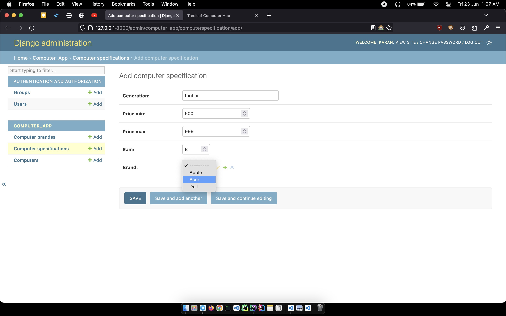

# Treeleaf Computer Hub

## Dependencies
<pre>
asgiref==3.7.2
crispy-tailwind==0.5.0
Django==4.2.2
django-crispy-forms==2.0
Pillow==9.5.0
sqlparse==0.4.4
</pre>

<pre>
pip install -r requirements.txt
</pre>

## Screenshots

- DB Schema

- Home

- Add Computer

- Update Computer

- Django Admin Panel - Computer Brands

- Django Admin Panel - Add Brand

- Django Admin Panel - Computer Specs.

- Django Admin Panel - Add Computer Spec.

- Django Admin Panel - Auto Add Total Price
